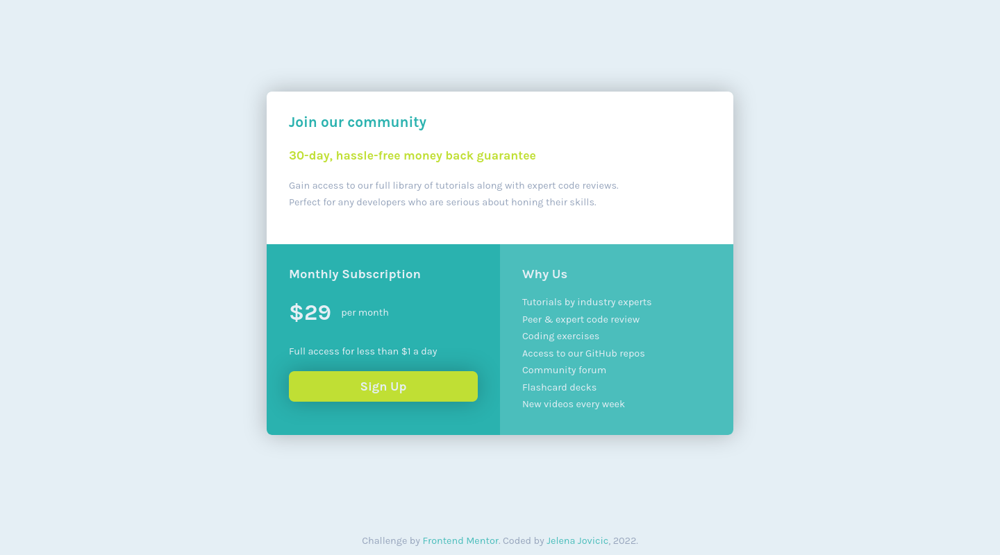

# Frontend Mentor - Single price grid component solution

This is a solution to the [Single price grid component challenge on Frontend Mentor](https://www.frontendmentor.io/challenges/single-price-grid-component-5ce41129d0ff452fec5abbbc). Frontend Mentor challenges help you improve your coding skills by building realistic projects. 

## Table of contents

- [Overview](#overview)
  - [Description](#description)
  - [Screenshot](#screenshot)
  - [Links](#links)
- [The process](#the-process)
  - [Built with](#built-with)
  - [Observations](#observations)
  - [Useful resources](#useful-resources)
- [Author](#author)

## Overview

### Description

This is a simple css challenge I used to test my [basic template](https://github.com/je-jo/basic-template).

### Screenshot

### Links

- [Repo](https://github.com/je-jo/single-price-grid-component)
- [Live Site](https://je-jo.github.io/single-price-grid-component/)

## My process

### Built with

- Semantic HTML5 markup
- CSS custom properties
- CSS Grid
- Flexbox
- Mobile-first workflow

### Observations

Learned that paragraph's max-width can mess with grid items' equal width.

### Useful resources

- [My Basic Template](https://github.com/je-jo/basic-template) pretty much based on Stephanie Eckless' [HTML / Sass Jumpstart](https://github.com/5t3ph/html-sass-jumpstart) but much simpler;

## Author

- [Github](https://github.com/je-jo)
- [Frontend Mentor](https://www.frontendmentor.io/profile/je-jo)
- [Codepen](https://codepen.io/je-jo)
- [Twitter](https://twitter.com/jelena_jo_)